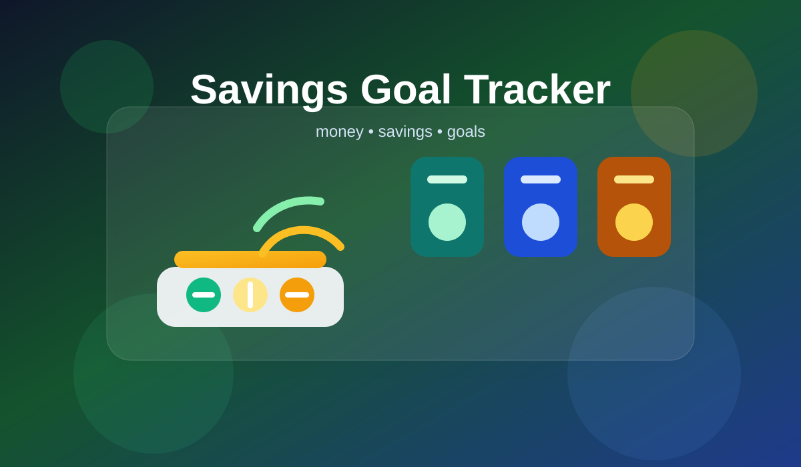

# Savings Goal Tracker

Spring Advanced project with two Spring Boot applications: a Spring MVC + Thymeleaf UI and a REST microservice for exchange-rate data, connected through OpenFeign.

| Module | Role | Port | Database | Notes |
| --- | --- | --- | --- | --- |
| `savings-goals-app` | Main Spring MVC + Thymeleaf application | `8080` | `savings_goals_tracker` | Uses Spring Security, OpenFeign, JPA, and a custom admin initializer |
| `goal-insights-service` | REST microservice consumed through OpenFeign | `8081` | `goal_insights_db` | Uses caching, scheduling, JPA, and REST exception handling |

## Architecture

- `savings-goals-app` is the user-facing web app.
- `goal-insights-service` is a separate REST service that manages exchange rates.
- The main app calls the microservice through `GoalInsightsClient`, which targets `http://localhost:8081`.
- The two applications use separate MySQL databases and separate Maven builds.
- `savings-goals-app` uses a `dev` profile and `application-dev.properties`.

## Main Features

### savings-goals-app

- Public registration and login for regular users.
- Session-based authentication with a custom success handler.
- User profile view and update.
- Password change with validation.
- Category management.
- Savings goal management.
- Deposit and withdrawal transactions.
- Balance updates and goal progress tracking.
- Admin user management: list users, change roles, delete users.
- Exchange-rate UI backed by the microservice.

### goal-insights-service

- REST endpoints for exchange rates.
- Create, update, delete, and list exchange rates.
- Exchange-rate calculation.
- Cache-backed reads for exchange rates.
- Scheduled logging tasks.

## Security

- `USER` accounts are created through public registration.
- The `ADMIN` account is created automatically at startup by `AdminUserInitializer` using `app.admin.password`.
- Public access is allowed for `/`, `/register`, `/login`, `/css/**`, and `/images/**`.
- `/profile/**` requires authentication.
- `/admin/**` requires the `ADMIN` role.
- Login uses email and password.
- The login success handler stores the current user id and username in the session.

## Project Structure

### savings-goals-app

```text
src/main/java/app
├── SavingsGoalsTrackerApplication.java
├── client
│   ├── GoalInsightsClient.java
│   └── dto
│       └── ExchangeRateResponse.java
├── config
│   ├── AdminUserInitializer.java
│   ├── AuthenticationSuccessHandler.java
│   ├── BeanConfiguration.java
│   └── SecurityConfig.java
├── exception
│   ├── GlobalExceptionHandler.java
│   └── SavingsGoalAppException.java
├── mapper
│   └── user
│       └── UserMapper.java
├── model
│   ├── dto
│   │   ├── category
│   │   │   └── CategoryForm.java
│   │   ├── savingsgoal
│   │   │   └── SavingsGoalForm.java
│   │   ├── transaction
│   │   │   └── TransactionForm.java
│   │   └── user
│   │       ├── UserDto.java
│   │       ├── UserLoginRequest.java
│   │       └── UserRegisterRequest.java
│   └── entity
│       ├── category
│       │   └── Category.java
│       ├── savingsgoal
│       │   └── SavingsGoal.java
│       ├── transaction
│       │   ├── Transaction.java
│       │   └── TransactionType.java
│       └── user
│           ├── User.java
│           └── UserRole.java
├── repository
│   ├── category
│   │   └── CategoryRepository.java
│   ├── savingsgoal
│   │   └── SavingsGoalRepository.java
│   ├── transaction
│   │   └── TransactionRepository.java
│   └── user
│       └── UserRepository.java
├── service
│   ├── GoalInsightsService.java
│   ├── category
│   │   └── CategoryService.java
│   ├── savingsgoal
│   │   └── SavingsGoalService.java
│   ├── transaction
│   │   └── TransactionService.java
│   └── user
│       ├── CustomUserDetailsService.java
│       └── UserService.java
└── web
    ├── AdminController.java
    ├── CategoryController.java
    ├── ExchangeRateViewController.java
    ├── GoalInsightsController.java
    ├── IndexController.java
    ├── SavingsGoalController.java
    ├── TransactionController.java
    └── UserController.java

src/main/resources
├── application-dev.properties
├── static
│   └── css
│       └── style.css
└── templates
    ├── admin-users.html
    ├── categories.html
    ├── category-add.html
    ├── category-edit.html
    ├── exchange-rates.html
    ├── goal-add.html
    ├── goal-edit.html
    ├── goals.html
    ├── home.html
    ├── index.html
    ├── login.html
    ├── profile.html
    ├── register.html
    ├── transaction-add.html
    └── transactions.html

src/test/java/app
├── config
│   └── SecurityConfigTest.java
├── service
│   ├── category
│   │   └── CategoryServiceTest.java
│   ├── savingsgoal
│   │   └── SavingsGoalServiceTest.java
│   ├── transaction
│   │   └── TransactionServiceTest.java
│   └── user
│       └── UserServiceTest.java
└── web
    ├── AdminControllerTest.java
    ├── CategoryControllerTest.java
    ├── SavingsGoalControllerTest.java
    ├── TransactionControllerTest.java
    └── UserControllerTest.java
```

### goal-insights-service

```text
src/main/java/app/goalinsights
├── GoalInsightsServiceApplication.java
├── exception
│   ├── ExchangeRateNotFoundException.java
│   └── GlobalExceptionHandler.java
├── model
│   └── entity
│       └── ExchangeRate.java
├── repository
│   └── ExchangeRateRepository.java
├── service
│   ├── ExchangeRateScheduler.java
│   └── ExchangeRateService.java
└── web
    └── ExchangeRateController.java

src/main/resources
└── application.properties

src/test/java/app
├── goalinsights
│   ├── service
│   │   └── ExchangeRateServiceTest.java
│   └── web
│       └── ExchangeRateControllerTest.java

src/test/resources
└── application.properties
```

## Technology Stack

| Area | Stack |
| --- | --- |
| Runtime | Java 17 |
| Backend | Spring Boot 3.5.16 |
| Web | Spring MVC, Thymeleaf |
| Data | Spring Data JPA, MySQL |
| Security | Spring Security, BCrypt |
| Integration | Spring Cloud OpenFeign |
| Build | Maven |
| Testing | JUnit 5, Mockito, Spring Boot Test, JaCoCo |

## How to Run

### Prerequisites

- Java 17
- Maven
- MySQL
- Database and admin passwords are provided through environment variables.

### Required environment variables

**goal-insights-service**
* DB_USERNAME=root
* DB_PASSWORD=`<password for your local MySQL root user>`

**savings-goals-app**
* DB_PASSWORD=`<password for your local MySQL root user>`
* ADMIN_PASSWORD=`<choose any password for the ADMIN user>`
* Active profile: dev

The ADMIN user is created automatically when the application starts:

* username: admin
* email: admin@savingsgoalstracker.com
* password: the value set in ADMIN_PASSWORD

### Local configuration

| Module | JDBC URL | Username | Port |
| --- | --- | --- | --- |
| `savings-goals-app` | `jdbc:mysql://localhost:3306/savings_goals_tracker?createDatabaseIfNotExist=true` | `root` | `8080` |
| `goal-insights-service` | `jdbc:mysql://localhost:3306/goal_insights_db?createDatabaseIfNotExist=true` |`root` | `8081` |

### Start order

1. Start MySQL.
2. Start `goal-insights-service` first.
3. Start `savings-goals-app` after the microservice is running.
4. Open the main application at `http://localhost:8080`.

### Commands

```bash
cd goal-insights-service
mvn spring-boot:run
```

```bash
cd savings-goals-app
mvn spring-boot:run -Dspring-boot.run.profiles=dev
```

## Testing

- `savings-goals-app` includes service, controller, and security tests.
- `goal-insights-service` includes service and controller tests.
- The project uses JaCoCo for coverage reports.
- Achieved coverage is approximately 72% for `savings-goals-app` and 76% for `goal-insights-service`.

## Logging and Exception Handling

- Both applications use SLF4J logging in services.
- The main app logs user, category, savings goal, and transaction operations.
- The microservice logs exchange-rate reads, writes, cache updates, and scheduled checks.
- Both applications expose centralized `@RestControllerAdvice` handlers for domain and generic errors.

## REST Microservice

`goal-insights-service` exposes exchange-rate endpoints under `/api/exchange-rates`:

- `GET /api/exchange-rates`
- `POST /api/exchange-rates`
- `PUT /api/exchange-rates/{id}`
- `DELETE /api/exchange-rates/{id}`
- `GET /api/exchange-rates/calculate?baseCurrency=...&targetCurrency=...`

It enforces `EUR` as the base currency when creating exchange rates and supports cross-rate calculation when a direct rate is not present.
